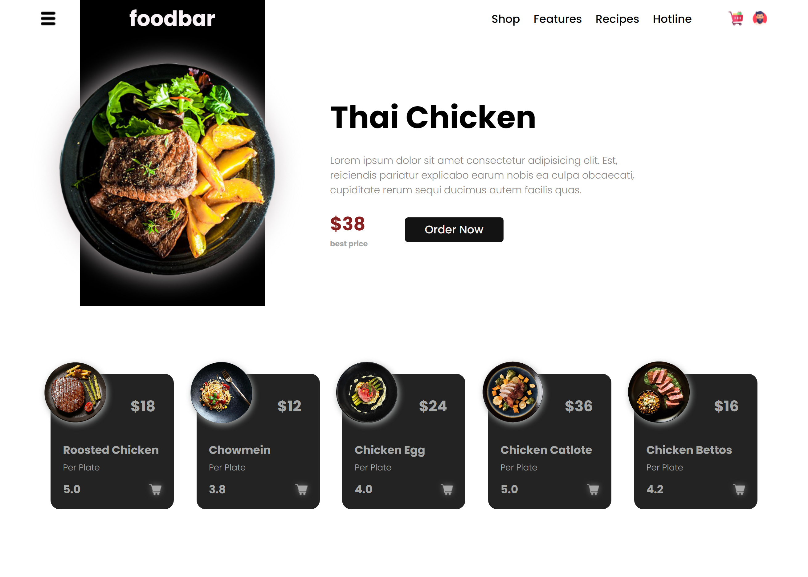

# FoodBar Landing Page

## Welcome! 👋

Thanks for checking out this front-end coding challenge.

**To do this challenge, you need a basic understanding of HTML, CSS and JavaScript.**

## The challenge

You can use any tools you like to help you complete the challenge. So if you've got something you'd like to practice, feel free to give it a go.

Your users should be able to:

- View the optimal layout for the app depending on their device's screen size

## Build

- HTML5 
- JavaScript 
- Sass